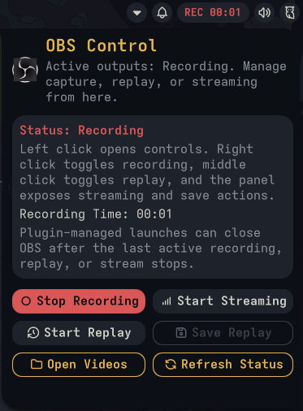

# OBS Control

OBS Studio controls for Noctalia Shell. The plugin adds a bar indicator, an optional Control Center shortcut, and a panel for recording, replay, and streaming actions.

## Requirements

Runtime requirements:

- `obs-studio`
- OBS WebSocket enabled in OBS
- QML `QtWebSockets` support available in the Quickshell runtime

On Arch Linux, install the Qt WebSockets module explicitly:

```bash
sudo pacman -S qt6-websockets
```

If `QtWebSockets` is missing, the plugin shows a clear runtime warning in its settings UI

## Installation

Open Noctalia Settings, go to `Plugins`, search for `OBS Control` in `Available`, and install it.

After enabling it, add `plugin:obs-control` to your bar or Control Center layout if you want the widget visible there.

## Features

- native QML `QtWebSockets` transport for OBS websocket control
- bar indicator for recording, replay, and streaming states, including combined active outputs
- optional Control Center shortcut when OBS is active
- panel with launch, refresh, recording, replay, streaming, save, and open-videos actions
- clear runtime state when `QtWebSockets` support is missing or OBS websocket is not configured
- auto-close for OBS when the plugin had to cold-launch it for recording, replay, or streaming and later stops the last active output
- elapsed recording and streaming timers in the panel
- configurable manual launch behavior, left-click behavior, bar label mode, toast behavior, and visibility rules
- native Noctalia toast actions after recording, replay, or stream transitions

## Keyboard Shortcuts

This plugin uses Noctalia IPC for compositor keybinds and external triggers.

Use Noctalia IPC directly from your compositor:

```bash
qs -c noctalia-shell ipc call plugin:obs-control togglePanel
qs -c noctalia-shell ipc call plugin:obs-control toggleRecord
qs -c noctalia-shell ipc call plugin:obs-control toggleReplay
qs -c noctalia-shell ipc call plugin:obs-control toggleStream
qs -c noctalia-shell ipc call plugin:obs-control saveReplay
```

Example `niri` binds:

```kdl
binds {
    Mod+F9 { spawn "qs" "-c" "noctalia-shell" "ipc" "call" "plugin:obs-control" "toggleRecord"; }
    Mod+F10 { spawn "qs" "-c" "noctalia-shell" "ipc" "call" "plugin:obs-control" "toggleReplay"; }
    Mod+Shift+F10 { spawn "qs" "-c" "noctalia-shell" "ipc" "call" "plugin:obs-control" "saveReplay"; }
    Mod+F11 { spawn "qs" "-c" "noctalia-shell" "ipc" "call" "plugin:obs-control" "toggleStream"; }
    Mod+F12 { spawn "qs" "-c" "noctalia-shell" "ipc" "call" "plugin:obs-control" "togglePanel"; }
}
```

## Troubleshooting

- If OBS is running but the plugin says WebSocket control is unavailable, restart OBS once after enabling obs-websocket.
- If the plugin says `Qt WebSockets support missing`, install `qt6-websockets` and restart Noctalia.
- If the plugin says OBS websocket is not configured, open OBS, confirm obs-websocket is enabled, then refresh or restart Noctalia. This also covers the case where the OBS websocket server is disabled in OBS.
- Automatic recording, replay, and stream starts intentionally launch OBS minimized to the tray; the Launch OBS action is the only path that uses the configurable launch behavior.
- If Open Videos opens a terminal directory handler instead of a GUI file manager, set the Videos Opener setting to your file manager command, for example `nautilus`.
- If recording, replay, or streaming launched OBS automatically through this plugin, stopping the last active output through the same plugin session will close OBS again for that managed launch.
- If actions do nothing, test `qs -c noctalia-shell ipc call plugin:obs-control refreshStatus` from a terminal in your session.

## Screenshots




